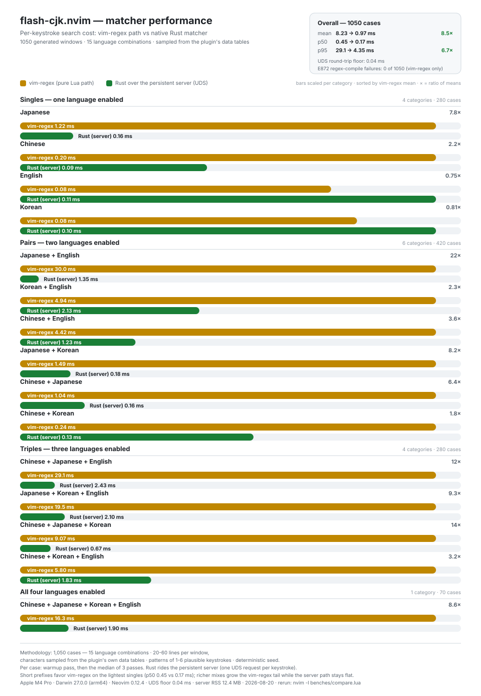

<div align="center">

# flash-cjk.nvim

在 Neovim 中输入拼音、罗马音（Romaji）或罗马字，即可跳转到任意简体中文、
日语或韩语字符——无需切换输入法。基于
[flash.nvim](https://github.com/folke/flash.nvim) 构建，fork 自
[flash-zh.nvim](https://github.com/rainzm/flash-zh.nvim)。

[English](README.md) · [简体中文](README.zh.md) · [日本語](README.ja.md) · [한국어](README.ko.md)

[](https://github.com/fang2hou/flash-cjk.nvim/actions/workflows/validate.yml)
[](./LICENSE)

</div>

## 为什么

为了跳转到 CJK 文本而再去输入 CJK 文本，意味着操作中途还得与输入法缠斗。
flash-cjk 让你的双手始终停留在 ASCII 上：`ni` 落在 日 / に / ニ，`r`
按拼音首字母命中 日，`dkss` 按两拼式键盘（두벌식）键位命中
안녕——同时普通字母依然按字面匹配，与 flash.nvim 的行为完全一致。

- 覆盖范围：简体中文拼音（小鹤双拼与拼音首字母）、日语罗马音（Romaji，
  汉字读音与假名，黑本式与训令式）、韩语（RR 罗马字与两拼式键盘键序）、
  ASCII 字面匹配——全部同时生效，且可各自独立开关
- 不在范围内：取代 flash.nvim 自带功能（treesitter 跳转、remote
  等）；输入法集成；NFD 形式的韩文文件名（见已知限制）
- 状态：活跃开发中

## 安装

需要 [flash.nvim](https://github.com/folke/flash.nvim)；使用
[lazy.nvim](https://github.com/folke/nvim-lazy) 安装：

```lua
return {{
    "fang2hou/flash-cjk.nvim",
    event = "VeryLazy",
    dependencies = "folke/flash.nvim",
    -- 可选的 Rust 加速器（见“Rust 加速”）：随安装/更新自动构建；
    -- 若没有 cargo，插件会静默改走 vim-regex 路径。
    -- 删除这一行即可完全跳过构建。
    build = "cargo build --release --manifest-path=rust/Cargo.toml",
    keys = {{
        "s",
        mode = {"n", "x", "o"},
        function()
            require("flash-cjk").jump()
        end,
        desc = "Flash jump (CJK + ASCII)"
    }},
    opts = {
        languages = {
            zhcn = {force_key = "<C-c>"},  -- 默认：启用，方案 "xiaohe"
            ja = {force_key = "<C-j>"},         -- 默认方案："roma"
            ko = {force_key = "<C-k>"},
            en = {force_key = "<C-e>"},         -- en 无方案概念
        },
        alpha_mixing = true,
    }
}, {
    "folke/flash.nvim",
    event = "VeryLazy",
    opts = {
        highlight = {
            backdrop = false,
            matches = false
        }
    }
}}
```

不用 lazy.nvim？自行调用 `require("flash-cjk").setup({ ... })`，选项与上面的
`opts` 相同。

## 使用

按下 `s`，输入，跳转——流程与 flash.nvim 一致。如果目标上还没出现标签，
继续输入即可（就像搜索一样）；标签使用小写字母，且绝不会与可见匹配项可能
出现的下一个输入字母冲突。

**配合 AI 编程代理**——把下面这段话粘贴给代理，把仓库交给它：

```text
Work in this repository. Read AGENTS.md at the repository root first and follow it.
```

### 输入中途强制锁定语言

输入过程中，按 `C-c` / `C-j` / `C-k` / `C-e` 可将匹配锁定为简体中文 /
日语 / 韩语 / 英语，并立即重新计算：

- `ti` 同时匹配简体中文（梯/踢…）与日语（ち，训令式）；按下 `C-c`
  后只剩简体中文读音——ち 不再匹配
- 锁定会叠加进输入串：**退格删过标记即解除锁定**；按其他锁定键可直接切换
- 锁定期间，英文字面匹配不受影响
- 锁定按键按语言在 `languages` 表中配置（`force_key`，设为 `false`
  可禁用）——见下文

### 语言配置

每种语言都通过 `languages` 表独立配置——全局经 setup 设置，或按次跳转用
语言代码数组 / 字段级覆盖：

```lua
require("flash-cjk").setup({
    languages = {
        zhcn = {enabled = true, scheme = "xiaohe", force_key = "<C-c>"},
        ja = {enabled = true, scheme = "roma", force_key = "<C-j>"},
        ko = {enabled = true, scheme = "roma", force_key = "<C-k>"},
        en = {enabled = true, force_key = "<C-e>"},  -- 无方案概念
    },
    alpha_mixing = true,
    priority = { "ja", "zhcn" },  -- 标签顺序：优先日语匹配
})

require("flash-cjk").jump({ "ja", "ko", "en" })  -- 本次跳转：不匹配简体中文
require("flash-cjk").jump(nil, { languages = { ja = { force_key = "<C-d>" } } })
require("flash-cjk").jump(nil, { priority = { "ko" } })  -- 本次跳转：韩语匹配优先获得标签
```

`scheme` 接受简体中文 `"xiaohe"`、日语/韩语 `"roma"`（目前仅有的方案，
今后可扩展）；`en` 为 ASCII 字面匹配，无方案概念，给了会报错。条目也接受
`true`/`false` 简写（等价于 `enabled`）。`setup` 深合并：未给出的字段保留
现值。不带数组的 `jump()` 使用 setup 启用集；给定数组即完整决定该次跳转的
启用集（方案取该语言默认值），并优先于 setup 开关。第二个参数透传 flash
选项，其中 `languages` 只对本次跳转生效——形状与 setup 相同。

`priority` 按语言决定标签分配顺序：排在前面的语言可达的匹配先拿到最早的
标签（可被多种语言解释的匹配按其中优先级最高的语言归属），主力语言的目标
更省 label 键。匹配集与跳转语义不变；未设置时保持位置顺序。

单语言用户只需保留一个语言启用。标点跟随语言开关：关闭 `zhcn` 时，`,`
匹配 、（日文）而非 ，（全角逗号）；`。` 为简体中文/日语共用，始终匹配；
`-` → ー 归属 `ja`。

## 按语言匹配

### 简体中文（zhcn）

输入小鹤双拼（Xiaohe double-pinyin）两键编码，或拼音首字母：`ni` → 你，
`r` → 日。每个汉字都能用两键编码到达；单个字母可命中所有拼音以该字母开头
的汉字。当前注册的方案是 `"xiaohe"`（见「语言配置」中的 `scheme`）——
目前唯一方案，今后可扩展。

### 日语（ja）

直接输入罗马音（Romaji）即可命中：输入 `ni` 命中“日”，输入 `ti` 命中
“ち”（训令式）。汉字读音取自 Unicode Unihan（`kJapanese`/`On`/`Kun`，
约 13,000 个汉字），按罗马音前缀匹配，前缀最长 3 个字母（`n`/`ni`/`nic`
均命中“日”）；假名匹配其音节的所有常见罗马音拼法（`si`/`shi`、
`tu`/`tsu`）；拗音成对作为一个整体匹配（`sha` → しゃ/シャ）；`-` 匹配
长音符 ー，`[`/`]` → 「」『』，`,` → 、，`!` → ！。

### 韩语（ko）

直接输入两拼式（두벌식，Dubeolsik，韩语标准键盘）键序：`dkss` → 안녕、
`gkrry` → 학교、`dkswek` → 앉다；也可以输入韩语罗马字（RR 表记法，
2000 年文化观光部式），并兼容常见的 McCune-Reischauer 拼法（`kim`/`gim`
→ 김），逐音节按前缀匹配。音节由程序规则分解为韩文字母（初声 × 中声 ×
终声）——无需词典数据。紧音字母在两拼式键盘上需按 Shift——建议改用罗马字
（`kk`）；单元音片段可像日语元音一样出现在输入中间（`ai` → 아이）。

### 英语（en）

ASCII 按字面逐字母匹配，与 flash.nvim 自带搜索完全一致——代码标识符无需
任何语言解释即可到达。`en` 无方案概念。即使关闭 `en`，数字与大写字母仍按
字面匹配；所有已启用语言都无法解读的输入（如 `n.`）会退化为字面匹配。

## 字母混排（alpha_mixing）

输入串可以把字面字母与语言片段混合解释成一条链：`n` 读作字母、`i` 读作
拼音，同样拼出 `ni` → 你；`nihao` 这类长输入还会因此多出一批混合链解释。

- 开启（默认）：输入的每一条混合链变体都保持可达。
- 关闭（`alpha_mixing = false`）：丢弃混合解释——三语长输入的最坏情况
  延迟降低 40–60%，代价是部分混合链路不可达。
- 建议：保持默认；仅当长输入打字明显卡顿时再关闭。

## 常见问题

- **会不会卡？** 短前缀（1–2 个字母）在内置 vim-regex 路径上中位数约
  0.5 ms 即可应答（单语言启用时 0.1–0.9 ms）。重负载场景是该路径上的
  三语长输入：最重的组合平均约 29 ms、p95 达 138–245 ms。启用原生匹配器
  后，所有组合都保持在 8–25 ms 的平坦区间。见下方基准表。
- **必须安装 Rust 吗？** 不必。`build =` 行只在有 cargo 时构建可选的原生
  匹配器；没有它，插件会静默改走 vim-regex 路径，结果完全一致（由交叉
  验证保证）。
- **费 CPU/电池吗？** vim-regex 路径是进程内正则。原生匹配器每个按键、
  每个可见窗口启动一个短命进程（约 9–12 ms 墙钟时间，几乎全是进程启动
  开销）——开销上限就是你的打字速度。
- **沙箱或受限环境？** 删掉 `build =` 行即可：纯 Lua 路径不需要编译器，
  也不启动任何进程。
- **什么时候需要 jump 数组形式？** 当某一次跳转想要与 setup 不同的启用集
  时——临时排除一门语言（`jump({ "ja", "ko", "en" })`），或到达被你禁用
  的语言（setup 里 `zhcn = { enabled = false }` 后，`jump({ "zhcn", "en" })`
  仍匹配简体中文）。
- **怎么修改或禁用 force_key？** 在 `languages` 表中——全局经 setup，或
  只对一次跳转生效：`force_key = "<M-c>"` 改键，`force_key = false` 禁用
  该语言的锁定。

## Rust 加速（可选）

可选的原生匹配器一次构建、自动启用：按下方基准测试，它压平了最坏情况——
p95 尾部延迟总体降低 2.3×，在日语/简体中文 + 英语混合下最高降低
10×——并且对正则选择分支已超出 Vim 编译上限（E872）的模式依然可用。上面
lazy spec 的 `build =` 行会自动处理；手动构建：

```sh
cd rust && cargo build --release
```

若没有二进制——或构建反复失败——插件会透明回退到纯 Lua 的 vim-regex
路径，行为完全一致，由逐项严格交叉验证套件保证。细节与测量数据见
[rust/README.md](rust/README.md)。

## 性能

<p align="center">
  
</p>

在完整语言组合矩阵上实测两条真实按键路径：四种语言代码——`zhcn`（简体中文）、`ja`（日语）、`ko`（韩语）、`en`（英语）——的全部单选、双选、三选与四选组合，共 15 组 × 70 个窗口 = 1,050 个 20–60 行的生成窗口。每一行只启用本行语言、从这些语言采样窗口文本、并键入 1–6 个对这些语言合理的按键（`en` 单选行为纯 ASCII 单词）；种子固定可复现。

**Rust（server）**是默认的原生路径：每次按键向常驻匹配服务发送一个请求（见下文）。**Rust（spawn）**是回退传输：每次按键启动一个短命进程。
单语言——只启用一种语言：

| 窗口语言 | vim-regex 均值 | Rust spawn | Rust server | 比率 | vim-regex p95 | spawn p95 | server p95 |
| -------- | -------------: | ---------: | ----------: | ---: | ------------: | --------: | ---------: |
| `ja`     |        1.02 ms |    8.45 ms |     0.20 ms | 5.2× |        4.6 ms |   8.77 ms |    0.42 ms |
| `zhcn`   |        0.22 ms |    8.94 ms |     0.15 ms | 1.4× |        0.6 ms |   9.49 ms |    0.21 ms |
| `en`     |        0.09 ms |    8.42 ms |     0.17 ms | 0.5× |        0.1 ms |   8.95 ms |    0.22 ms |
| `ko`     |        0.09 ms |    8.46 ms |     0.15 ms | 0.6× |        0.2 ms |   8.75 ms |    0.21 ms |

双语言——启用两种语言：

| 窗口语言      | vim-regex 均值 | Rust spawn | Rust server |  比率 | vim-regex p95 | spawn p95 | server p95 |
| ------------- | -------------: | ---------: | ----------: | ----: | ------------: | --------: | ---------: |
| `ja` + `en`   |       28.62 ms |    9.87 ms |     1.32 ms | 21.7× |      133.5 ms |  13.76 ms |    4.78 ms |
| `ko` + `en`   |        4.82 ms |   10.57 ms |     2.18 ms |  2.2× |       34.9 ms |  25.43 ms |   16.80 ms |
| `zhcn` + `en` |        4.26 ms |    9.88 ms |     1.29 ms |  3.3× |       42.6 ms |  20.83 ms |   11.85 ms |
| `ja` + `ko`   |        1.10 ms |    8.50 ms |     0.22 ms |  5.1× |        3.9 ms |   8.91 ms |    0.38 ms |
| `zhcn` + `ja` |        1.10 ms |    8.97 ms |     0.23 ms |  4.8× |        4.5 ms |   9.64 ms |    0.42 ms |
| `zhcn` + `ko` |        0.25 ms |    8.91 ms |     0.20 ms |  1.3× |        0.6 ms |   9.41 ms |    0.31 ms |

三语言——启用三种语言：

| 窗口语言             | vim-regex 均值 | Rust spawn | Rust server |  比率 | vim-regex p95 | spawn p95 | server p95 |
| -------------------- | -------------: | ---------: | ----------: | ----: | ------------: | --------: | ---------: |
| `zhcn` + `ja` + `en` |       28.77 ms |   11.34 ms |     2.52 ms | 11.4× |      244.9 ms |  24.19 ms |   14.88 ms |
| `ja` + `ko` + `en`   |       20.08 ms |   10.77 ms |     2.18 ms |  9.2× |      125.8 ms |  25.50 ms |   16.01 ms |
| `zhcn` + `ja` + `ko` |        8.83 ms |    9.52 ms |     0.70 ms | 12.6× |       46.3 ms |  10.71 ms |    2.18 ms |
| `zhcn` + `ko` + `en` |        5.47 ms |   10.60 ms |     1.86 ms |  2.9× |       32.2 ms |  19.33 ms |   10.69 ms |

四种语言全部启用：

| 窗口语言                    | vim-regex 均值 |  Rust spawn | Rust server |     比率 | vim-regex p95 |    spawn p95 |  server p95 |
| --------------------------- | -------------: | ----------: | ----------: | -------: | ------------: | -----------: | ----------: |
| `zhcn` + `ja` + `ko` + `en` |       16.43 ms |    10.80 ms |     1.97 ms |     8.4× |       89.6 ms |     22.57 ms |    14.09 ms |
| **总体（1,050 个窗口）**    |    **8.08 ms** | **9.60 ms** | **1.02 ms** | **7.9×** |   **30.1 ms** | **12.83 ms** | **4.27 ms** |

**方法。** 每个用例先跑一次预热，再取 3 次实测的中位数（`vim.uv.hrtime`）；组内行按 vim-regex 均值排序。比率为 vim-regex 均值 ÷ Rust server 均值——低于 1× 表示纯 Lua 路径更快。vim-regex 计时覆盖真实按键的全部开销：模式切分、备选分支构建、`vim.regex()` 编译、以及每个可见行的匹配扫描。Rust 计时同样覆盖全部：server 系列是向常驻服务发送的一个 UDS 请求（真实路径），spawn 系列是每次按键完整启动一个进程（回退传输）。本轮 0/1,050 个模式触发 Vim 的 NFA 捕获组上限（E872），但即使触发，Rust 匹配器仍可继续工作。

**如何解读。** spawn 传输每次按键都要支付约 9 ms 的固定底噪（约 0.9 ms 进程创建 + 8.2 ms 数据表构建），使原生路径在所有轻量组合上落败。常驻服务只在启动时支付一次，之后在 0.15–2.5 ms 的平坦区间内应答：15 个类别中有 13 个转为 Rust 占优，其余两个（`ko`/`en` 单选）为 0.09 对 0.15–0.17 ms——双方都在 0.2 ms 以内。更重要的是尾部：最重的组合（`ja`+`en`、`zhcn`+`ja`+`en`）的 p95 从 vim-regex 的 133–245 ms 降到 4.8–14.9 ms，总体 p95 从 30.1 ms 降到 4.3 ms。spawn → server：均值 9.60 → 1.02 ms（9.4×），p50 8.89 → 0.23 ms，p95 12.8 → 4.3 ms。

### 后台服务（Unix，零配置）

二进制存在时，插件会透明地为每个用户维护一个匹配服务：

- **生命周期**：一个 Neovim 实例持有空闲会话连接期间即视为注册。退出 Neovim（或被 `kill -9`）会立即注销；当没有任何实例连接超过 2 秒（`FLASH_CJK_SERVER_GRACE_MS`）时，服务删除自己的 socket 并退出。最后一个实例离开时服务随之消失——没有轮询、没有守护进程管理、没有配置。
- **内存**：仅一个常驻进程，约 12.4 MB RSS，且只在至少一个 Neovim 实例使用它时存在。
- **自动回退**：传输层偶发故障（超时、崩溃）会让该次按键回退到逐键 spawn 传输，并异步拉起替代服务；连续失败则触发既有熔断器，退到 vim-regex 路径。Windows 与超长 socket 路径（`sun_path` 上限）保持 spawn 传输。

**系统影响。** 不再是每次按键、每个可见窗口一个约 9–12 ms 的短命进程，代价变为：每个用户一个约 12.4 MB 的常驻进程（只在编辑期间存在），外加每次按键约 0.04 ms 的 Unix domain socket 往返。CPU/电池开销现在取决于输入量，而不是进程启动次数。二进制约 1.8 MB，静态携带数据表，无运行时依赖。若二进制缺失、构建失败或运行时反复失败，熔断器会触发，每次按键透明回退到 vim-regex 路径——匹配结果完全一致，由交叉验证套件保证。当常驻内存紧张或进程启动受限时，偏好纯 vim-regex 路径（即不构建二进制）。

在您自己的机器上复现：

```sh
cargo build --release --manifest-path rust/Cargo.toml
nvim -l benches/compare.lua # 写入 benches/results.json
uv run benches/gen_svg.py   # 重新生成 assets/benchmark.svg
```

## 已知限制

- macOS 以 NFD（分解的韩文字母序列）存储韩文文件名；两条匹配路径都针对
  NFC 预组合音节，因此在 oil/netrw 的文件名缓冲区中跳转时无法匹配韩文
  文件名。普通代码与文档缓冲区为 NFC，不受影响。

## 延伸阅读

| 目标             | 阅读                                                                       |
| ---------------- | -------------------------------------------------------------------------- |
| 开发与验证       | [DEVELOPMENT.md](./DEVELOPMENT.md)                                         |
| 了解系统         | [ARCHITECTURE.md](./ARCHITECTURE.md)                                       |
| 参与贡献         | [CONTRIBUTING.md](./CONTRIBUTING.md)                                       |
| 交给 AI 代理     | [AGENTS.md](./AGENTS.md)                                                   |
| 原生匹配器设计   | [rust/README.md](./rust/README.md)                                         |
| 阅读其他语言版本 | [简体中文](README.zh.md) · [日本語](README.ja.md) · [한국어](README.ko.md) |

## 环境要求

- Neovim ≥ 0.10，配合 [flash.nvim](https://github.com/folke/flash.nvim)
- 可选：较新的 Rust（≥ 1.97，cargo）用于原生加速器——没有它一切功能照常可用
- 开发工具链：由 mise 管理（参见 [DEVELOPMENT.md](./DEVELOPMENT.md)）

## 许可证

MIT——见 [LICENSE](./LICENSE)。数据衍生自
[Unicode Unihan 数据库](https://www.unicode.org/)（Unicode License）。感谢
[flash-zh.nvim](https://github.com/rainzm/flash-zh.nvim) 与
[hop-zh-by-flypy](https://github.com/zzhirong/hop-zh-by-flypy)。
